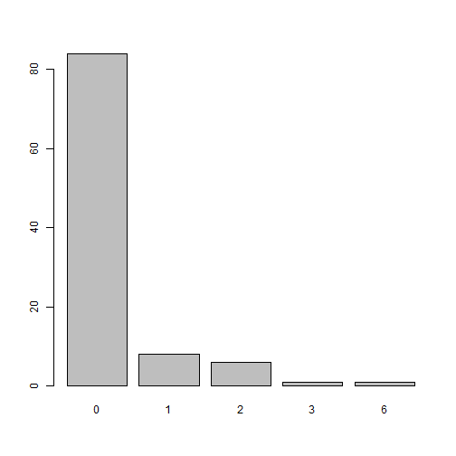
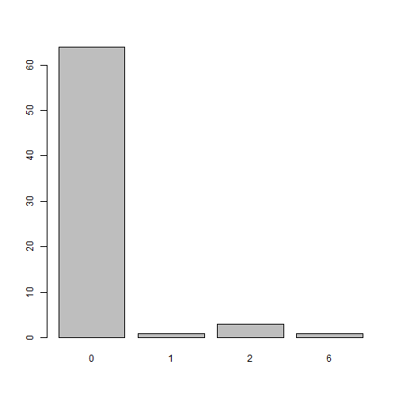

# coder 

[](https://github.com/ropensci/coder/actions) 
[](https://app.codecov.io/gh/ropensci/coder) 
[](https://www.repostatus.org/#active) [](https://zenodo.org/badge/latestdoi/65975808) [](https://joss.theoj.org/papers/10.21105/joss.02916)
[](https://CRAN.R-project.org/package=coder)


<!-- README.md is generated from README.Rmd. Please edit that file -->


## Aim of the package

The goal of `{coder}` is to classify items from one dataset, using codes from a secondary source with classification schemes based on regular expressions and weighted indices.

## Installation

You can install the released version of coder from [CRAN](https://CRAN.R-project.org) with:

``` r
# install.packages("coder")
```

And the development version from [GitHub](https://github.com/) with:

``` r
# install.packages("remotes")
remotes::install_github("eribul/coder")
```

## Typical use case

-   Determining comorbidities before clinical trials
-   Discovering adverse events after surgery

**Patient data:** The initial rationale for the package was to classify patient data based on medical coding. A typical use case would consider patients from a medical/administrative data base, as identified by some patient id and possibly with some associated date of interest (date of diagnoses/treatment/intervention/hospitalization/rehabilitation). This data source could be for example an administrative hospital register or a national quality register.

**Codify:** The primary source could then be linked to a secondary (possibly larger) data base including the same patients with corresponding id:s and some coded patient data. This could be a national patient register with medical codes from the International Classification of Diseases *(ICD)* with corresponding dates of hospital visits/admission/discharge, or a medical prescription register with codes from the Anatomic Therapeutic Chemical *(ATC)* classification system with dates of medical prescription/dispatch/usage. A time window could be specified relating the date of the primary source (i. e. the date of a primary total hip arthroplasty; THA), to dates from the secondary source (i.e. the date of a medical prescription). ATC codes associated with medical prescriptions during one year prior to THA, could thus be identified and used as a measure of comorbidity. Another time window of 90 days after THA, might instead be used to identify adverse events after surgery.

**Classify:** To work with medical/chemical codes directly might be cumbersome, since those classifications tend to be massive and therefore hard to interpret. It is thus common to use data aggregation as proposed by some classification or combined index from the literature. This could be the *Charlson* or *Elixhauser* comorbidity indices based on ICD-codes, or the *RxRisk V* classification based on ATC-codes. Each of those tools appear with different code versions (ICD-8, ICD-9, ICD-9-CM, ICD-10, ICD-10-CA, ICD-10-SE, ICD-10-CM et cetera) and with different codes recognized as relevant comorbidities (the Charlson index proposed by Charlson et al, Deyo et al, Romano et al. Quan et al. et cetera). Using a third object (in addition to the primary and secondary patient data sets) helps to formalize and structure the use of such classifications. This is implemented in the `coder` package by `classcodes` objects based on regular expressions (often with several alternative versions). Those `classcodes` objects could be prepared by the user, although a number of default `classcodes` are also included in the package (table below).

**Index:** Now, instead of working with tens of thousands of individual ICD-codes, each patient might be recognized to have none or some familiar comorbidity such as hypertension, cancer or dementia. This granularity might be too fine-grained still, wherefore an even simpler index score might be searched for. Such scores/indices/weighted sums have been proposed as well and exist in many versions for each of the standard classifications. Some are simple counts, some are weighted sums, and some accounts for some inherited hierarchy (such that ICD-codes for diabetes with and without complications might be recognized in the same patient, although the un-complicated version might be masked by the complicated version in the index).

**Conditions:** Some further complexity might appear if some codes are only supposed to be recognized based on certain conditions. Patients with THA for example might have an adverse event after surgery if a certain ICD-code is recorded as the main diagnose at a later hospital visit, although the same code could be ignored if recorded only as a secondary diagnosis.

**To summarize:** The coder package takes three objects: (1) a data frame/table/tibble with id and possible dates from a primary source; (2) coded data from a secondary source with the same id and possibly different dates and; (3) a `classcodes` object, either a default one from the package, or as specified by the user. The outcome is then: (i) codes associated with each element from (1) identified from (2), possibly limited to a relevant time window; (ii) a broader categorization of the relevant codes as prescribed by (3), and; (iii) a summarized index score based on the relevant categories from (3).

(i-iii) corresponds to the output from functions `codify()`, `classify()` and `index()`, which could be chained explicitly as `codify() %>% classify() %>% index()`, or implicitly by the `categorize()` function.

## Usage

Assume we have some patients with surgery at specified dates:


```r
library(coder)
ex_people
#> # A tibble: 100 × 2
#>    name              surgery   
#>    <chr>             <date>    
#>  1 Chen, Trevor      2022-08-12
#>  2 Graves, Acineth   2022-05-04
#>  3 Trujillo, Yanelly 2022-04-21
#>  4 Simpson, Kenneth  2022-07-24
#>  5 Chin, Nelson      2022-07-07
#>  6 Le, Christina     2022-02-08
#>  7 Kang, Xuan        2022-05-13
#>  8 Shuemaker, Lauren 2022-02-09
#>  9 Boucher, Teresa   2022-07-18
#> 10 Le, Soraiya       2022-06-22
#> # … with 90 more rows
```

Those patients (among others) were also recorded in a national patient register with date of hospital admissions and diagnoses codes coded by the International Classification of Diseases (ICD) version 10:


```r
ex_icd10
#> # A tibble: 2,376 × 4
#>    name                 admission  icd10 hdia 
#>    <chr>                <date>     <chr> <lgl>
#>  1 Tran, Kenneth        2022-02-23 S134A FALSE
#>  2 Tran, Kenneth        2022-08-09 W3319 FALSE
#>  3 Tran, Kenneth        2022-07-19 Y0262 TRUE 
#>  4 Tran, Kenneth        2022-06-11 X0488 FALSE
#>  5 Sommerville, Dominic 2022-07-31 V8104 FALSE
#>  6 Sommerville, Dominic 2022-03-11 B853  FALSE
#>  7 Sommerville, Dominic 2022-07-26 Q174  FALSE
#>  8 Sommerville, Dominic 2022-03-16 A227  FALSE
#>  9 Sommerville, Dominic 2022-07-21 H702  FALSE
#> 10 Sommerville, Dominic 2021-11-12 X6051 TRUE 
#> # … with 2,366 more rows
```

Using those two data sets, as well as a classification scheme (`classcodes` object; see below), we can easily identify all Charlson comorbidities for each patient:


```r
ch <- 
  categorize(
    ex_people,                  # patients of interest 
    codedata = ex_icd10,        # Medical codes from national patient register
    cc = "charlson",            # Calculate Charlson comorbidity
    id = "name", code = "icd10" # Specify column names
  )
#> Classification based on: icd10

ch
#> # A tibble: 100 × 25
#>    name              surgery    myocardial.infarction congestive.heart.failure peripheral.vascular.disease cerebrovascular.dise…¹ demen…² chron…³ rheum…⁴ pepti…⁵ mild.…⁶ diabe…⁷ hemip…⁸ renal…⁹ diabe…˟ malig…˟ moder…˟ metas…˟ AIDS.…˟ charl…˟ deyo_…˟ dhoore ghali quan_…˟ quan_…˟
#>    <chr>             <date>     <lgl>                 <lgl>                    <lgl>                       <lgl>                  <lgl>   <lgl>   <lgl>   <lgl>   <lgl>   <lgl>   <lgl>   <lgl>   <lgl>   <lgl>   <lgl>   <lgl>   <lgl>     <dbl>   <dbl>  <dbl> <dbl>   <dbl>   <dbl>
#>  1 Chen, Trevor      2022-08-12 FALSE                 FALSE                    FALSE                       FALSE                  FALSE   FALSE   FALSE   FALSE   FALSE   FALSE   FALSE   FALSE   FALSE   FALSE   FALSE   FALSE   FALSE         0       0      0     0       0       0
#>  2 Graves, Acineth   2022-05-04 FALSE                 FALSE                    FALSE                       FALSE                  FALSE   FALSE   FALSE   FALSE   FALSE   FALSE   FALSE   FALSE   FALSE   FALSE   FALSE   FALSE   FALSE         0       0      0     0       0       0
#>  3 Trujillo, Yanelly 2022-04-21 FALSE                 FALSE                    FALSE                       FALSE                  FALSE   FALSE   FALSE   FALSE   FALSE   FALSE   FALSE   FALSE   FALSE   FALSE   FALSE   FALSE   FALSE         0       0      0     0       0       0
#>  4 Simpson, Kenneth  2022-07-24 FALSE                 FALSE                    FALSE                       FALSE                  FALSE   FALSE   FALSE   FALSE   FALSE   FALSE   FALSE   FALSE   FALSE   FALSE   FALSE   FALSE   FALSE         0       0      0     0       0       0
#>  5 Chin, Nelson      2022-07-07 FALSE                 FALSE                    FALSE                       FALSE                  FALSE   FALSE   FALSE   FALSE   FALSE   FALSE   FALSE   FALSE   FALSE   FALSE   FALSE   FALSE   FALSE         0       0      0     0       0       0
#>  6 Le, Christina     2022-02-08 FALSE                 FALSE                    FALSE                       FALSE                  FALSE   FALSE   FALSE   FALSE   FALSE   FALSE   FALSE   FALSE   FALSE   TRUE    FALSE   FALSE   FALSE         2       1      1     0       2       2
#>  7 Kang, Xuan        2022-05-13 FALSE                 FALSE                    FALSE                       FALSE                  FALSE   FALSE   FALSE   FALSE   FALSE   FALSE   FALSE   FALSE   FALSE   FALSE   FALSE   FALSE   FALSE         0       0      0     0       0       0
#>  8 Shuemaker, Lauren 2022-02-09 FALSE                 FALSE                    FALSE                       FALSE                  FALSE   TRUE    FALSE   FALSE   FALSE   FALSE   FALSE   FALSE   FALSE   FALSE   FALSE   FALSE   FALSE         1       1      1     0       1       1
#>  9 Boucher, Teresa   2022-07-18 FALSE                 FALSE                    TRUE                        FALSE                  FALSE   FALSE   FALSE   FALSE   FALSE   FALSE   FALSE   FALSE   FALSE   FALSE   FALSE   FALSE   FALSE         1       1      1     2       1       0
#> 10 Le, Soraiya       2022-06-22 FALSE                 FALSE                    FALSE                       FALSE                  FALSE   FALSE   FALSE   FALSE   FALSE   FALSE   FALSE   FALSE   FALSE   FALSE   FALSE   FALSE   FALSE         0       0      0     0       0       0
#> # … with 90 more rows, and abbreviated variable names ¹​cerebrovascular.disease, ²​dementia, ³​chronic.pulmonary.disease, ⁴​rheumatic.disease, ⁵​peptic.ulcer.disease, ⁶​mild.liver.disease, ⁷​diabetes.without.complication, ⁸​hemiplegia.or.paraplegia, ⁹​renal.disease,
#> #   ˟​diabetes.complication, ˟​malignancy, ˟​moderate.or.severe.liver.disease, ˟​metastatic.solid.tumor, ˟​AIDS.HIV, ˟​charlson, ˟​deyo_ramano, ˟​quan_original, ˟​quan_updated
```

How many patients were diagnosed with malignancy?


```r
sum(ch$malignancy)
#> [1] 5
```

What is the distribution of the combined comorbidity index for each patient?


```r
barplot(table(ch$charlson))
```



There are many versions of the Charlson comorbidity index, which might be controlled by the `index` argument. We might also be interested only in diagnoses from 90 days before surgery as specified with an argument list `codify_args`as passed to `codify()`:


```r
ch <- 
  categorize(
    ex_people, codedata = ex_icd10, cc = "charlson", id = "name", code = "icd10",
    
    # Additional arguments
    index       = c("quan_original", "quan_updated"), # Indices
    codify_args = list(
      date      = "surgery",   # Name of column with index dates
      code_date = "admission", # Name of column with code dates
      days      = c(-90, -1)   # Time window
    )
  )
#> Classification based on: icd10
```

Number of malignancies during this period?


```r
sum(ch$malignancy, na.rm = TRUE)
#> [1] 3
```

Distribution of the index as proposed by Quan et al 2011 during the 90 day period:


```r
barplot(table(ch$quan_updated))
```



## Classification schemes

Classification schemes (`classcodes` objects, see `vignette("classcodes")`) are based on regular expressions for computational speed (see `vignette("Interpret_regular_expressions")`), but their content can be summarized and visualized for clarity. Arbitrary `classcodes` objects can also be specified by the user.

The package includes default `classcodes` for medical patient data based on the international classification of diseases version 8, 9 and 10 (ICD-8/9/10), as well as the Anatomical Therapeutic Chemical Classification System (ATC) for medical prescription data.

Default `classcades` are listed in the table. Each classification (classcodes column) can be based on several code systems (regex column) and have several alternative weighted indices (indices column). Those might be combined freely.


```r
coder::all_classcodes()
#> # A tibble: 7 × 3
#>   classcodes    regex                                                                              indices                                                               
#>   <chr>         <chr>                                                                              <chr>                                                                 
#> 1 charlson      icd10, icd9cm_deyo, icd9cm_enhanced, icd10_rcs, icd8_brusselaers, icd9_brusselaers "charlson, deyo_ramano, dhoore, ghali, quan_original, quan_updated"   
#> 2 cps           icd10                                                                              "only_ordinary"                                                       
#> 3 elixhauser    icd10, icd10_short, icd9cm, icd9cm_ahrqweb, icd9cm_enhanced                        "sum_all, sum_all_ahrq, walraven, sid29, sid30, ahrq_mort, ahrq_readm"
#> 4 hip_ae        icd10, kva, icd10_fracture                                                         ""                                                                    
#> 5 hip_ae_hailer icd10, kva                                                                         ""                                                                    
#> 6 knee_ae       icd10, kva                                                                         ""                                                                    
#> 7 rxriskv       atc_pratt, atc_caughey, atc_garland                                                "pratt, sum_all"
```

# Relation to other packages

`coder` uses `data.table` as a backend to increase computational speed for large datasets. There are some R packages with a narrow focus on Charlson and Elixhauser co-morbidity based on ICD-codes ([icd](https://CRAN.R-project.org/package=icd), [comorbidity](https://CRAN.R-project.org/package=comorbidity), [medicalrisk](https://CRAN.R-project.org/package=medicalrisk), [comorbidities.icd10](https://github.com/gforge/comorbidities.icd10), [icdcoder](https://github.com/wtcooper/icdcoder)). The `coder` package includes similar functionalities but has a wider scope.

# Code of conduct

Please note that this package is released with a [Contributor Code of Conduct](https://ropensci.org/code-of-conduct/). By contributing to this project, you agree to abide by its terms.
