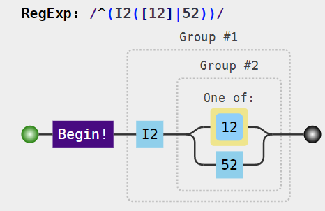

```{r, include = FALSE}
knitr::opts_chunk$set(
  collapse = TRUE,
  comment = "#>"
)
```

```{r setup}
library(coder)
```

Classification is implemented by classcodes objects with regular expressions identifying different groups. Default classcodes object included in the package are:

```{r}
all_classcodes()$classcodes
```

We will have a closer look at one of those objects, `charlson`, to exemplify its content. The object is basically a `tibble` (data frame):

```{r}
charlson
```

... with some additional attributes:

```{r}
attributes(charlson)
```

# Columns

-   The "group" column contains short descriptive names of all groups to classify by. Those names might contain spaces and other special characters which might be transformed when used (argument `tech_names` in `set_classcodes`).
-   Column "description" (optional) provides additional details of each group.
-   All columns with names prefixed by `regex_` (also found by `attr(charlson, "regexprs")`) specify different versions of group identification based on regular expressions (see `?charlson` for details). Those regular expressions only identifies individual codes but this can be controlled further by arguments `start` and `stop` to `set_classcodes`.
-   Columns with names prefixed by `index_` (also found by `attr(charlson, "indices")`) are numeric variables used as weights when calculating index sums based on all (or a subset of) individual groups.
-   Other classcodes objects might have an additional column "condition" for conditional classification (see for example `?hip_ae`).

# Hierarchy

Some classcodes objects (see for example `?elixhauser`) might have an additional class attribute "hierarchy", controlling hierarchical groups where only one of possibly several groups (occurring simultaneity) should be recognized for calculation of a weighted index sum.

# Interpret the regular expressions

## Visualize graphically

Regular expressions might be difficult to interpret but can be visualized by `visualize()`. This will usually display a web page in the default browser (here suppressed by `show = FALSE`):

```{r}
url <- visualize(charlson, show = FALSE, regex = "regex_icd10")
```

Here, we can open the `url` "manually" by a link to the [JavaScript Regular Expression Parser & Visualizer](%60r%20url%60). The displayed visualization is rather complex, however, wherefore a further simplification might be needed before actual understanding of the concept. We can chose to inspect the regular expression for `r charlson$group[1]` as codified by `regex_icd9cm_deyo`:

```{r}
visualize(
  charlson, 
  group    = "myocardial infarction", 
  show     = FALSE, 
  regex    = "regex_icd9cm_deyo"
)
```

```{r, echo = FALSE}
knitr::include_graphics("regexp_charlson_ci_icd9.png")

```

Here `^` indicates the beginning of the character string, followed by a literal `41` and either a `0` or `2`. The corresponding code according to ICD-10 is:

```{r}
visualize(
  charlson, 
  group    = "myocardial infarction", 
  show     = FALSE, 
  regex    = "regex_icd10"
)
```

```{r, echo = FALSE}


```

ICD-10 codes identifying myocardial infarction thus starts with `I2` followed by either `1`, `2` or `52`. The vertical bar, `|`, in the regular expression indicates a logical "or" within the parenthesis (as used for expressions longer than single characters).

## List all codes

An alternative representation is to list all relevant codes identified by each regular expression. This is implemented by the `summary` method for classcodes objects. (We here use the print method with `n = 30` to fit the output to the width of the vignette.)

```{r}
summary(charlson, coding = "icd10cm")
```

## Interpretable codebook

Even with individual codes summarized, those might still be hard to interpret on their own. The [decoder](https://cancercentrum.bitbucket.io/decoder/) package can help to translate codes to readable names/description. This is facilitated by the `codebook` function. The main purpose of the function is to export an Excel-file (if path specified by argument `file`). The output is otherwise a list, including both a summary table (described above) and a data frame "all\_codes":

```{r}
codebook(charlson, "icd10cm")
```

Here, the descriptions are based on the ICD-10-CM codes from 2020. Corresponding descriptions in Swedish are retrieved by (`icd10se` instead of `icd10cm`):

```{r}
codebook(charlson, "icd10se")$all_codes
```

## Combined codebooks

Several codebooks can be combined (exported to a single Excel-file) by the function `codebooks` (note the plural s).

# Alternative classifications

Examples above use the default regex column (currently ICD-10). If we are interested in another version, for example specified by Deyo et al. based on ICD-9-CM, this can be specified by the `regex`-argument passed by the `cc_args` argument to the `set_classcodes` function. Simultaneously, the `coding` argument is set to `icd9cmd` to match the regular expressions to the disease part of ICD-9-CM classification.

```{r}
summary(
  charlson, coding = "icd9cmd",
  cc_args = list(regex = "regex_icd9cm_deyo")
)
```

# Set classcodes objects

Some functions do not use the classcodes object themselves, but a modified version passed through the `set_classcodes` function. This function can be called directly but is more often invoked by arguments passed by the `cc_args` argument used in other functions (as exemplified above).

We can modify the `charlson` classcodes object as follows:

```{r}
charlson_icd8 <- 
  set_classcodes(
    "charlson",
    regex = "regex_icd8_brusselaers", # Version based on ICD-8
    start = FALSE, # Codes do not have to occur in the beginning of a vector
    stop = TRUE, # Code vector must end with the specified codes
    tech_names = TRUE # Use long but unique and descriptive variable names
  )
```

The resulting object has only one `regex`-column. It is based on "regex\_icd8\_brusselaers" but suffixed with `$` (due to `stop = TRUE`). Group names might seem cumbersome but this will help to distinguish column names added by `categorize` if this function is run repeatedly with different classcodes. The original `charlson` object had `r nrow(charlson)` rows, but `charlson_icd8` has only `r nrow(charlson_icd8)`, since not all groups are defined by that version.

```{r}
charlson_icd8
```

Note that all indices columns remain (although not showed above):

```{r}
names(charlson_icd8)
```

It is thus possible to combine any categorization with any index, although some combinations might be preferred (such as `regex_icd9cm_deyo` combined with `index_deyo_ramano`).
